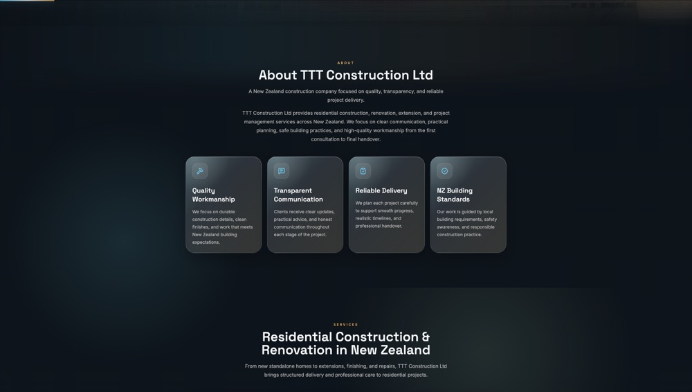
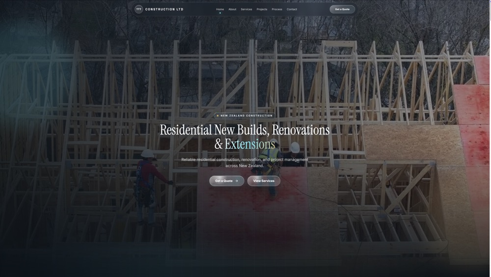
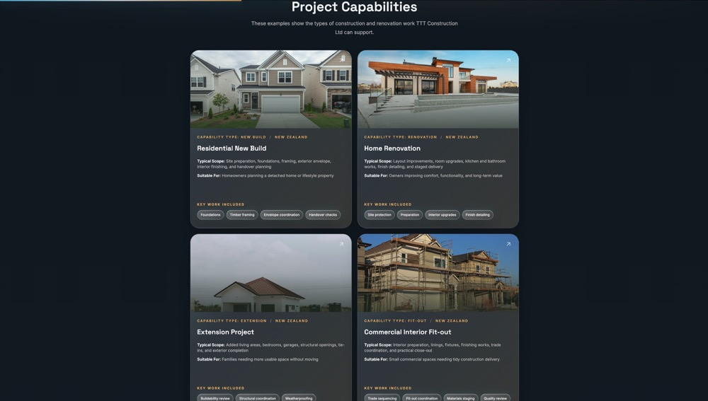

# TTT Construction Ltd — Company Website

A responsive company website built for a New Zealand residential construction business, featuring dynamic project pages, modern UI design, and smooth animations.

## Live Demo

**🔗 [https://ttt-construction-ltd.vercel.app](https://ttt-construction-ltd.vercel.app)**

## Overview

This is a commercial website project for TTT Construction Ltd, a residential construction company based in New Zealand. The site showcases the company's services, project capabilities, and provides a contact form for potential clients.

**Target Users:** Homeowners and property developers looking for construction services in New Zealand

**Business Purpose:** Online presence for client acquisition and service showcase

**Project Type:** Company website (frontend-only)

## Tech Stack

### Frontend
- **Next.js 16** — React framework with App Router for SSR and SSG
- **React 19** — Component-based UI library
- **TypeScript** — Type-safe development
- **Tailwind CSS** — Utility-first CSS framework
- **Framer Motion** — Animation library for scroll effects and transitions

### Deployment
- **Vercel** — Automatic deployment with CI/CD pipeline

### Development Tools
- **ESLint** — Code quality and linting
- **PostCSS** — CSS processing

## Key Features

- **Dynamic Project Pages** — `/projects/[slug]` routes with static generation at build time
- **Responsive Design** — Mobile-first approach with tablet and desktop breakpoints
- **Glass Morphism UI** — Modern frosted glass aesthetic with backdrop blur effects
- **Scroll Animations** — Intersection Observer API with Framer Motion for reveal effects
- **SEO Optimization** — Meta tags, Open Graph protocol, and semantic HTML
- **Contact Form** — Client inquiry form with validation
- **Reusable Components** — Modular component architecture for maintainability

## Architecture

### Frontend Structure
- **App Router** — Next.js 13+ file-based routing system
- **Static Site Generation (SSG)** — All pages pre-rendered at build time for optimal performance
- **Component Architecture** — Reusable React components with TypeScript interfaces
- **Data Layer** — Centralized project data in `lib/data/projects.ts` with TypeScript types

### Routing
- `/` — Homepage with hero, about, services, projects, and contact sections
- `/projects/[slug]` — Dynamic project detail pages (4 pages generated at build time)

### No Backend
This is a frontend-only application. All content is statically generated at build time. No server-side API or database is used.

## Project Structure

```
ttt-construction-ltd/
├── app/
│   ├── layout.tsx              # Root layout with metadata
│   ├── page.tsx                # Homepage
│   └── projects/[slug]/
│       └── page.tsx            # Dynamic project detail pages
├── components/
│   ├── project-detail/         # Project page components
│   │   ├── ProjectHero.tsx
│   │   ├── ProjectOverview.tsx
│   │   ├── ProjectTimeline.tsx
│   │   ├── ProjectGallery.tsx
│   │   ├── ProjectMaterials.tsx
│   │   └── ProjectCTA.tsx
│   ├── Hero.tsx                # Homepage hero section
│   ├── About.tsx               # About section
│   ├── Services.tsx            # Services grid
│   ├── Projects.tsx            # Project capabilities grid
│   ├── Contact.tsx             # Contact form
│   ├── Navbar.tsx              # Navigation bar
│   ├── Footer.tsx              # Footer
│   ├── Reveal.tsx              # Scroll reveal wrapper
│   └── SectionHeading.tsx      # Reusable heading component
├── lib/
│   └── data/
│       └── projects.ts         # Project data with TypeScript interfaces
├── public/
│   └── images/                 # Static image assets
├── screenshots/                # Project screenshots for README
├── styles/
│   └── globals.css             # Global styles and Tailwind config
└── README.md
```

## Installation and Setup

```bash
# Clone the repository
git clone https://github.com/zj115/ttt-construction-ltd.git
cd ttt-construction-ltd

# Install dependencies
npm install

# Run development server
npm run dev
```

Open [http://localhost:3000](http://localhost:3000) to view the site locally.

### Build for Production

```bash
# Create optimized production build
npm run build

# Start production server locally
npm start
```

### Deployment

The project is configured for automatic deployment on Vercel. Every push to the `main` branch triggers a new build and deployment.

## Environment Variables

**No environment variables are required for this project.**

This is a static frontend application with no backend services, APIs, or database connections.

## Screenshots

### Homepage Hero Section


### About & Services Section


### Project Capabilities Section


## My Contribution

I built this entire project from scratch as a commercial website for a New Zealand construction company. My work included:

- **Frontend Development** — Implemented all React components using Next.js 16 App Router and TypeScript
- **UI/UX Design** — Created a modern glass morphism design system with Tailwind CSS
- **Dynamic Routing** — Built `/projects/[slug]` pages with static generation for 4 project types
- **Data Architecture** — Designed a centralized data layer with TypeScript interfaces for type safety
- **Animations** — Integrated Framer Motion for smooth scroll reveals and transitions
- **Responsive Design** — Ensured mobile-first responsive layouts across all breakpoints
- **SEO Optimization** — Implemented meta tags, Open Graph protocol, and semantic HTML structure
- **Deployment** — Configured Vercel deployment with automatic CI/CD pipeline
- **Documentation** — Wrote comprehensive README with screenshots and technical details

## Security and Privacy

- ✅ No production credentials are included in this repository
- ✅ No real customer data or business-sensitive information is exposed
- ✅ No API keys, database credentials, or secrets in the codebase
- ✅ `.gitignore` properly configured to exclude sensitive files
- ✅ All screenshots use publicly available demo content
- ✅ Environment variables are not required for this static site

This project is safe to share publicly as part of my portfolio.

## Future Improvements

- Add a CMS (e.g., Sanity or Contentful) for non-technical content updates
- Implement a backend API for the contact form with email notifications
- Add a blog section for construction tips and company updates
- Integrate Google Analytics for traffic monitoring
- Add more project case studies with real construction photos

## Notes

- This repository is shared for portfolio and demonstration purposes
- The project showcases modern frontend development practices suitable for commercial websites
- Some business details may be simplified or anonymized for privacy

## License

This repository is shared for portfolio and demonstration purposes only. Commercial reuse is not permitted without permission.

---

**Developer:** Zicong Jiang  
**Education:** Master of Information Technology, University of Waikato  
**Year:** 2025  
**GitHub:** [github.com/zj115](https://github.com/zj115)
